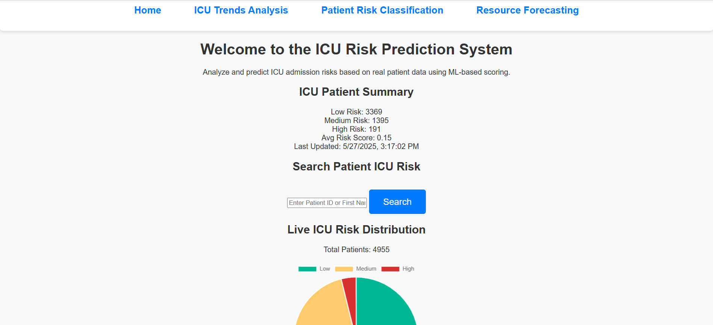
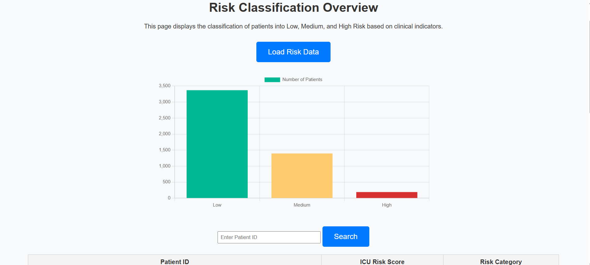
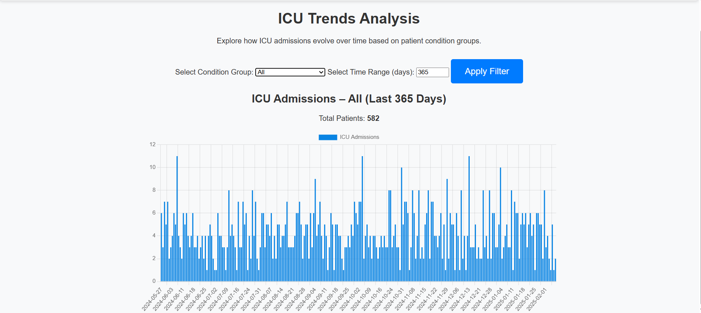

# ICU Risk Prediction and Resource Forecasting System

This is a complete machine learning and data engineering pipeline that predicts ICU risk, classifies patients by risk category, and forecasts ICU resource needs using synthetic EHR data.

Built using **Python**, **Flask**, and **scikit-learn**, this system simulates a real-world ICU triage tool for prioritizing care and planning resource allocation.

---

## Project Goals

- Predict ICU admission probability
- Classify patients as Low / Medium / High risk
- Calculate Base Resource Unit (BRU) to measure resource demand
- Forecast ICU bed and cost demand for the next 7–30 days
- Visualize insights using a Flask GUI

---

## Technologies Used

- **Python 3.10**
- **Flask** – Web application
- **Pandas, NumPy** – Data wrangling
- **Matplotlib, Seaborn** – EDA and visualization
- **Scikit-learn** – Modeling (Linear & Logistic Regression)
- **Docker** – Containerization

---

## Machine Learning Models

| Task                      | Model Used           | Target            |
|---------------------------|----------------------|-------------------|
| Risk Score Prediction     | Linear Regression     | `Final_Risk_Score` (continuous) |
| ICU Admission Prediction  | Logistic Regression   | `ICU_ADMISSION` (binary) |
| BRU Classification        | Logistic Regression   | `BRU_Category` (binary) |

> Models were selected based on target type and interpreted using clinical logic.

---

## Risk Score Formula (Manually Weighted)

**Risk Score = w₁·A + w₂·V + w₃·L + w₄·C + w₅·M + w₆·E**

Where:
- **A**: Normalized Age  
- **V**: Vital Signs Score  
- **L**: Lab Results Score  
- **C**: Comorbidity Score  
- **M**: Medications & Procedures Score  
- **E**: Encounter History Score

The weights `w₁` through `w₆` were assigned based on **clinical scoring systems and published ICU triage literature** to reflect real patient severity and risk patterns.


---

## Base Resource Unit (BRU) Formula

**BRU = α₁·(Base Encounter Cost + Procedure Cost + Medication Cost) + α₂·(β₁·Emergency Visits)**

Where:
- **α₁**, **α₂**: Weights for cost vs. urgency  
- **β₁**: Multiplier for emergency burden

This BRU formula is modeled on **ICU cost and urgency estimation frameworks**, mimicking how hospitals estimate demand pressure.

---

## Data Sources

Data was generated using **[Synthea](https://synthetichealth.github.io/synthea/)** – a tool that simulates realistic but synthetic electronic health records.

### Files used:

- `patients.csv`  
- `observations.csv`  
- `conditions.csv`  
- `medications.csv`  
- `procedures.csv`  
- `encounters.csv`

All datasets are hosted externally due to GitHub size limits:  
🔗 [Access via Google Drive]https://drive.google.com/drive/folders/1fzN-hZqPjJudntMW8kggDMrAHszBdNim?usp=drive_link

---

## Pipeline Overview

1. **Data Cleaning**  
   Removed deceased and age > 100  
2. **Feature Engineering**  
   Aggregated vitals, labs, encounters, and conditions  
3. **Manual Scoring**  
   Computed Risk Score and BRU using clinically weighted formulas  
4. **ML Modeling**  
   Linear & Logistic regression for predictions  
5. **Visualization**  
   Flask-based web interface for interaction

---

## Run Locally

```bash
git clone https://github.com/siva-279/icu-risk-prediction.git
cd icu-risk-prediction
pip install -r requirements.txt
python app.py


---

## Screenshots

### Home Page


### Risk Classification Page


### ICU Trends Page


### Forecasting Page


---

---

## Author

**Siva Sava**

- [LinkedIn](https://www.linkedin.com/in/sivasava)  
- savasivakumar271200@gmail.com


